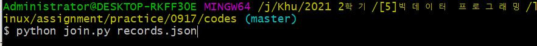
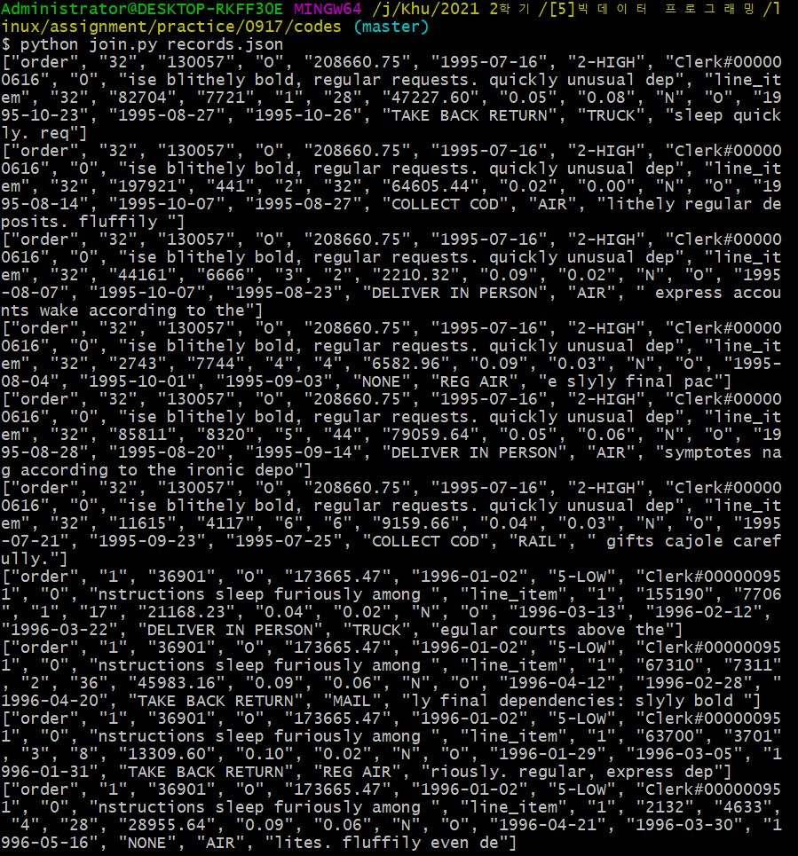

# MapReduce

`맵리듀스` 는 여러 노드에 작업을 분할하는 방법이다. 빅 데이터 분석을 진행할 때, 데이터가 한 노드에서 처리하기 힘들 만큼 많은 경우 여러 노드에 작업을 분할 할당한다면 보다 효율적으로 작업을 처리할 수 있을 것이다. 맵리듀스는 `맵(Map)` 태스크와 `리듀스(Reduce)` 작업으로 나뉜다. 맵 태스크에서는, 분할된 작업에 대해 각 부분에 대한 작업을 처리한다. key/value 쌍으로 분류한다. 리듀스 태스크에서는 작업이 끝나고 분류되어 정렬(Shuffled)된 정보들을 종합한다.


# Problem

```
Mappe Input: [table_identifier, join_key, sequence of
other columns]
● ["order", "32", "130057", "O", "208660.75", "1995-07-16", "2-HIGH",
"Clerk#000000616", "0", "ise blithely bold, regular requests. quickly unusual dep"]
● ...
● ["line_item", "32", "82704", "7721", "1", "28", "47227.60", "0.05", "0.08", "N", "O",
"1995-10-23", "1995-08-27", "1995-10-26", "TAKE BACK RETURN", "TRUCK", "sleep
quickly. req"]
```

라는 record.json 이 있다. 이 데이터들을 

```
● ... Reduce Output: [sequence of the columns of ORDER, sequence of
the columns of LINEITEM]
● ["order", "32", "130057", "O", "208660.75", "1995-07-16", "2-HIGH",
"Clerk#000000616", "0", "ise blithely bold, regular requests. quickly unusual dep",
"line_item", "32", "82704", "7721", "1", "28", "47227.60", "0.05", "0.08", "N", "O",
"1995-10-23", "1
```

의 형태로 출력해야 한다. 이 경우 Mapper와 Reducer를 만들어 보자.


# Mapper

input 배열의 두 번째 아이템인 `join_key` 를 key로, input 배열을 value로 만든다. 이를 딕셔너리로 저장한다.

``` python
def mapper(record):
    mr.emit_intermediate(record[1],record)
```


# Reducer

Mapper에서 생성한 딕셔너리에서, join_key를 기준으로 하여 배열들을 분류하였다. 따라서 딕셔너리의 value에 있는 배열들을 order과 item으로 나누어 각 집단의 요소들을 join 해주었다.

``` python
def reducer(key, list_of_values):
    order_list = []
    item_list = []
    for item in list_of_values:
        if(item[0] == "order"):
            order_list.append(item)
        elif (item[0]=="line_item"):
            item_list.append(item)

    for odr in order_list:
        for item in item_list:
            mr.emit(odr+item)
```

# Result



의 명령어를 실행하여,



의 결과를 얻었다. `join_key` 가 같은 배열들이 합쳐진 것을 볼 수 있다.