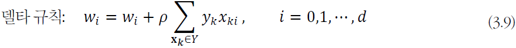

# 기초

## 퍼셉트론

### 구조
* 입력층과 출력층 가짐
* 입력층의 i번째 노드는 특정 벡터 x = (x1,x2,...,xd)의 xi 를 담당
* 항상 1이 입력되는 바이어스 노드
* 입력층 노드와 출력층을 연결하는 에지는 가중치 wi를 가짐

### 동작
* 특징값과 가중치를 곱한 결과를 모두 더해 s를 구하고 활성함수 적용
* 활성함수로 계단함수를 사용하므로 최종 출력은 1 혹은 -1
* 결정 직선 d(x) = d(x1,x2) = w1x1+w2x2+w0 = 0 은 전체 공간을 1과 -1의 두 부분공간으로 분할하는 분류기 역할을 한다.

### 학습

* 학습 문제
    * 지금까지 학습을 마친 퍼셉트론을 가지고 동작을 설명함.
    * AND 분류 문제

        * 
         w1, w2, w0 이 어떤 값을 가져야 100% 옳게 분류될까?
    * Haberman survival 분류 문제
        * 
          현실 세계는 d차원에 수천~ 수만개의 샘플이 존재함

* 목적함수 설계
    * 조건
        * J(w) >= 0 이다.
        * w 가 최적이면 j(w) = 0 이다.
        * 틀리는 샘플이 많은 w일수록 J(w) 값이 커진다.
    * 그레이디언트 계산
        * 가중치 갱신 규칙 
            * w = w-pg 를 적용시키려면 그레이디언트 g 필요함
            * 델타 규칙
            * 

* 행렬 표기

## 다층 퍼셉트론
퍼셉트론은 선형 분류기라는 한계가 있다. 선형 분리 불가능한 상황에서는 일정한 양의 오류가 생긴다. XOR 문제에서는 75%가 정확률 한계이다.
* 핵심 아이디어
    * 은닉층을 둔다. 특징 공간을 분류하는데 훨씬 유리한 새로운 특징 공간으로 변환
    * 시그모이드 활성함수 도입. 연성 의사결정이 가능. 출력을 신뢰도로 간주함으로써 융통성 있게 의사결정 가능
    * 오류 역전파 알고리즘 사용. 다층 퍼셉트론은 여러 층이 순차적으로 이어진 구조여서 역방향으로 진행하며 한번에 한 층씩 그레이디언트를 계산하고 가중치를 갱신하는 방식의 오류 역전파 알고리즘 사용
* 퍼셉트론 2개를 사용한 xor 문제의 해결
    * 
퍼셉트론 2개를 병렬로 결합하면, 원래 공간을 새로운 특징 공간으로 변환한다. 새로운 특징 공간에서는 선형 분리가 가능하다. 새로운 특징 공간에서 선형 분리를 수행하는 또 다른 새로운 퍼셉트론을 순차 결합하면, 퍼셉트론 3개를 결합한 다층 퍼셉트론이 된다.

## 활성함수
* 계단함수는 hard decision
    * 영역을 점으로 변환
* 로지스틱 시그모이드, 하이퍼볼릭 탄젠트 시그모이드 등은 soft decision
    * 영역을 영역으로 변환

## 구조
* 특징의 개수 + 1 개의 입력 노드, 부류 개수의 출력 노드
* p개의 출력 노드: p는 하이퍼 파라미터. p가 너무 크면 과잉적합, 너무 작으면 과소적합
* 
    * U1 의 uji는 입력층의 i번째 노드를 은닉층의 j번째 노드와 연결
    * U2 의 ukj는 은닉층의 j번째 노드를 출력층의 k번째 노드와 연결
## 동작
특징 벡터 x를 출력 벡터 o로 매핑하는 함수로 간주할 수 있다.
 
은닉층은 *특징 추출기* 이다. 특정 벡터를 분류에 더 유리한 새로운 특징 공간으로 변환한다.

# 오류 역전파 알고리즘
## 목적함수의 정의

* 훈련집합
    * 특징 벡터와 부류 벡터 집합
    * 부류 벡터는 원한 코드로 표현됨
* 기계 학습의 목표: 모든 샘플을 옳게 분류하는 함수 f를 찾는 일
* 목적함수 
    * 평균 제곱 오차 MSE로 정의

* 스토캐스틱 경사 하강법
    * 미니배치 스토캐스틱 경사 하강법
        * 한번에 t개의 샘플 처리. t = 1 이면 스토캐스틱 경사 하강법, t = n 이면 배치 경사 하강법.
        * 그레이디언트의 잡음을 줄여주는 효과 때문에 수렴 빨라짐
        * GPU 를 사용한 병렬처리에도 유리함.

# 다층 퍼셉트론의 특성
## 오류 역전파 알고리즘의 빠른 속도
## 모든 함수를 정확하게 근사할 수 있는 능력
## 성능 향상을 위한 휴리스틱의 중요성